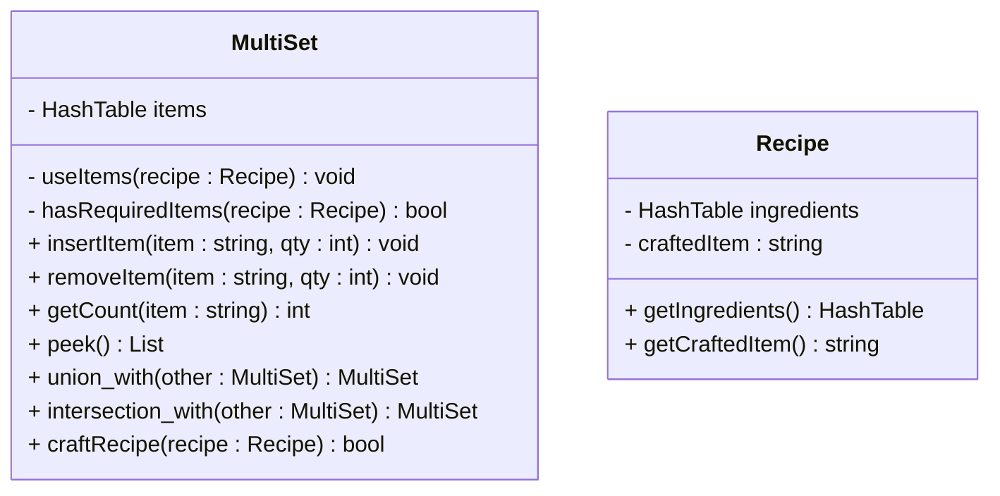

# MultiSet Design

**Corinna Green**
CS-3100-01
12/5/2025

## Introduction
- My design models an enemy loot table where certain items drop when the enemy is killed. 
- There will be different items along with quantities per each. 
- The items will be classified as strings and built atop HashTable<string, unsigned int>.

## Design Philosophy
### Qualities of Design
- **Efficiency:** Finding items must be fast during gameplay, preferring O(1) time complexity for inserting, removing, or looking for an item.
- **Simplicity:** Interface should be easy for other game code accessibility, such as other methods/classes interworking like getters, setters, addItem(), removeItem(), etc.
- **Extensibility:** Interface/other design choices should allow extensions to be added/incorporated easily for future features.
- **Readability:** Code should be organized clearly so that developers can easily understand how the structure works without needing to know the inner workings of hashing.
### Identify the Client
- The client will be the **game system** responsible for generating enemy-dropped-items
- The users are **other developers** responsible for calling functions from the MultiSet to change or get item quantities.

## Core Operations

**Item insertion**

- Conceptual purpose: When an enemy drops an item, the item gets added to the player’s inventory table. If the item already exists in the table, the count/quantity of the item increases. OW the item is added with quantity 1.
- Time complexity: O(1) due to constant hash table insertion and item updates
- Edge cases
    - Picking up an item when the quantity max is at its limit. 
    - Large quantities of dropped items being added at once
- How the HashTable supports
    - The HashTable will directly map each item to its count.
  
**Item deletion**

- Conceptual purpose: When the player uses the item, the system decreases its count. If the quantity becomes 0, then the item can be deleted from the table.
- Time complexity: O(1) from constant hash table look up and sets
- Edge cases:
    - Removing an item that doesn’t exist
    - Removing all items or just one item
- How the HashTable supports
    -Looks up item by key and further access to item’s quantity. Then deletes the key and decreasing the count
  
**Count lookup**

- Conceptual purpose: Game logic will check how many copies of an item are available. (Like determining what items enemy drops or what items players need to craft something) 
- Time complexity: O(1) for looking up items
- Edge cases
    - Seeing an item that is not in the table should return null
    - Item naming, case sensitivity
- How the HashTable supports
    -Hashing the item will give direct access to the stored item and count without scanning through other items first
  
**Inventory peek**

- Conceptual purpose: The game will show a full list of items in the loot inventory for debugging and/or showing enemy’s loot drops
- Time complexity: O(n) where n is the unique number of items in table
- Edge cases
    - A completely blank table
    - An inventory that is too large and might take too long to iterate through
- How the HashTable supports
    -The hash table stores key-value pairs and iterating through each slot returns each item and count
  
## Set Operations
**union_with():** combining two inventories or loot tables
- Accomplished Gameplay: This operation combines the loot items from two inventories. This multipurpose operation could merge loot drops of enemies or combine a player’s inventory with a backpack with more loot. Shared items will have their quantities summed together.
- Data Structure Manipulation: This operation iterates through both hash tables. It first inserts each item from the original inventory to the new one by count. Then, it iterates through the new inventory and adds new item keys and increases count value.
- Conceptual Complexity: 
    - Time Complexity: O(n) and O(m) (n is the number of items in inventory 1 and m inventory 2)
    - Edge Cases:
        - Both inventories are empty
        - Maxed count of items- could result in overflow
          
**intersection_with():** Find items shared between two inventories 
- Accomplished Gameplay: This operation finds items that are found in both inventories. This could be used to determine items needed for crafting requirements and comparing two different enemies and if what they drop is the same
- Data Structure Manipulation: The code iterates through one hash table checking if each item’s key exists/matches with the other table. If an item appears in both, the operation will keep the largest count.
- Conceptual Complexity
    - Time Complexity: O(n) and O(m) (minimum of m or n) (Because it will iterate through the smaller table and do comparing with the other)
    - Edge Cases:
        - Both tables are empty
        - No items that are overlapping (null intersection)
          
## Extension Feature
Feature: craftRecipe() — consumes ingredients to create a new item
- New Data & Data Needed
    - A Method to Check Ingredients
        - Make sure that all needed items exist in player inventory
        - Player item quantity must be >= to items needed for crafting recipe system
        - Stores the name of crafted item
        - List of needed items for crafting
        - Could be represented as another MultiSet
    - Item used Method
        - Decrease the item count when used for crafting
        - Delete items when their count reaches 0
- Why Feature Adds Value
    - Player tools/item flexibility: Players can decide what resources to find or save to make their own crafted item. It helps player engagement.
    - Crafting an item makes the MultiSet into a part of the player’s progression and activity
    - The design could later promote extensibility, like more dynamic recipes, recipe discovery systems, etc.
 
## UML Diagram



## Psuedocode

```
function craftRecipe(recipe):
for each (item, requiredIngrQty) in recipe.ingredients:
// Ingredients less than the ingredience quantity needed
if inventory.getCount(item) < requiredIngrQty: return false

// if here, all ingredients are ready, so remove each item in required ingredients list
for each (item, requiredIngQty) in recipe.ingredients:
inventory.removeItem(item, requiredIngQty)

// Then insert new crafted item into inventory
inventory.insertItem(recipe.craftedItem, 1)
return true
```

## Trade-off Analysis

### Alternative: AVLTree
I chose the HashTable data structure for my MultiSet because it uses fast average time complexity operations like insertion, deletion, look-up, and count. Constant time average performance is more important to an inventory-based game than the exact ordering of items within the inventory. Thus, I decided not to use the AVLTree because its advantages of keeping items sorted and in order are not supported in my gameplay. Balancing nodes in an AVLTree would require more complexity, especially with each rotation that happens when inserting or deleting a node. Using a HashTable is much simpler and has a better average-case performance for updating the inventory table and items within. The AVLTree’s sorted order is not needed, making the HashTable data structure a more efficient choice.

### Table Summary
| Aspects | HashTable | AVLTree (Alternative) |
|---------|-----------|------------------------|
| **Advantages** | - Average O(1) insertion, deletion, lookup<br>- Simple key→count mapping<br>- Ideal for fast gameplay queries | - Automatically sorted keys<br>- Great for ordered traversals<br>- Guaranteed O(log n) operations |
| **Disadvantages** | - Worst-case O(n) if collisions occur<br>- No sorted ordering<br>- Requires resizing / rehashing | - More complex implementation<br>- Insert/delete require balancing rotations<br>- Higher constant-time overhead |
| **Insert Complexity** | Avg O(1), worst O(n) | O(log n) |
| **Remove Complexity** | Avg O(1), worst O(n) | O(log n) |
| **Lookup Complexity** | Avg O(1), worst O(n) | O(log n) |

Source: https://www.cs.cornell.edu/courses/cs312/2008sp/lectures/lec20.html

## Alternative Design
I had had chosen the MultiSet using an AVLTree, my design would most likely prioritize sorting items instead of utilizing faster average-time access. The AVLTree would involve having to balaqnce a tree when enacting operations such as insert, remove, and lookup, making the system slower than the HashTable data structure. For an AVLTree, inventory peeks and crafting displays would already be ordered, but gameplay operations would be less quick and effiecient. The AVLTree would most certainly be more order-based, but not as speedy as the HashTable. 

In research, some hybrid designs can combine hashing with AVL trees by placing an AVLTree inside each hash bucket. This can reduce hash table collision slowdowns from O(n) to O(log n). However, this is unnecessary for normal gameplay inventory tables, so we wont't need it.
(Source: https://www.researchgate.net/publication/283760058_A_Hybrid_Chaining_Model_with_AVL_and_Binary_Search_Tree_to_Enhance_Search_Speed_in_Hashing)

## Evaluation Plan

When testing my design, I would use unit tests to verify the insert, remove, lookup, and edge-case tests work. So if I inserted a new item, the count would be one. If I look up items, it should display the correct count. I would also make sure edge cases work such as checking if the inventory is empty. I would then test the performance, to make sure the system maintains about O(1) behavior in normal gameplay

To make sure I can still modify or add to this design in the future, I will make sure it checks:
- Easy class coexistence, meaning handling hash, resizing, and counting with other classes will not break the existing code.
- Making the inventory super simple, meaning I will make sure this design in flexible in the ways other developers may want to extend on it. So the operations will remain unchanged even when new features are added.

## Conclusion / Reflection

My design is built on efficiency and strength because it focuses on performance and faster gameplay. I chose this so that the operations needed in order to access inventory items are quickly enacted. The operations will run in constant average time. Certain trade-offs will occur in exchange for higher performance. One trade-off is ordering of any sort. Thus, the system would not maintain alphabetical or numerical ordering. If I had chosen to work with an AVLTree, automatic ordering would be gauranteed, but at the cost of O(log n), worst case time complexity for every operation. Thus, slower speeds and average performance with more complex rotating/balancing logic. 

With more time or iteration, I would improve by adding features like a more flexible iterator system and maybe the ability to use different hash functions depending on the item types. I would also be interested in trying out a hybrid design, like AVL trees inside of hash buckets, to get rid of worst-case performances. Throughout this project, object oriented principals helped shape my design:

- Abstraction:
  Certain parts of the game code do not need to be shown and seen from the developers. Hence, the MultiSet will hide the whole interface using hashing and resizing through operations insert, remove, and count. The game system itself doen't need to know these parts, as these parts deal with pure abstraction.
- Encapsulation:
  Privately stored data, such as bucket arrays and item counts, are preventing outside code from changing the internal structure directly. These should never be changes, that is why they are private.
- Composition:
  The MultiSet is composed of buckets and item-count pairs, which is essentially what the whole inventory system is made up of. The MultiSet can then branch out/extend to different gameplay features like crafting, using, etc. This makes it extendable.

These cases make sure that my design is maintainable and adaptable, while keeping the performance efficient.
